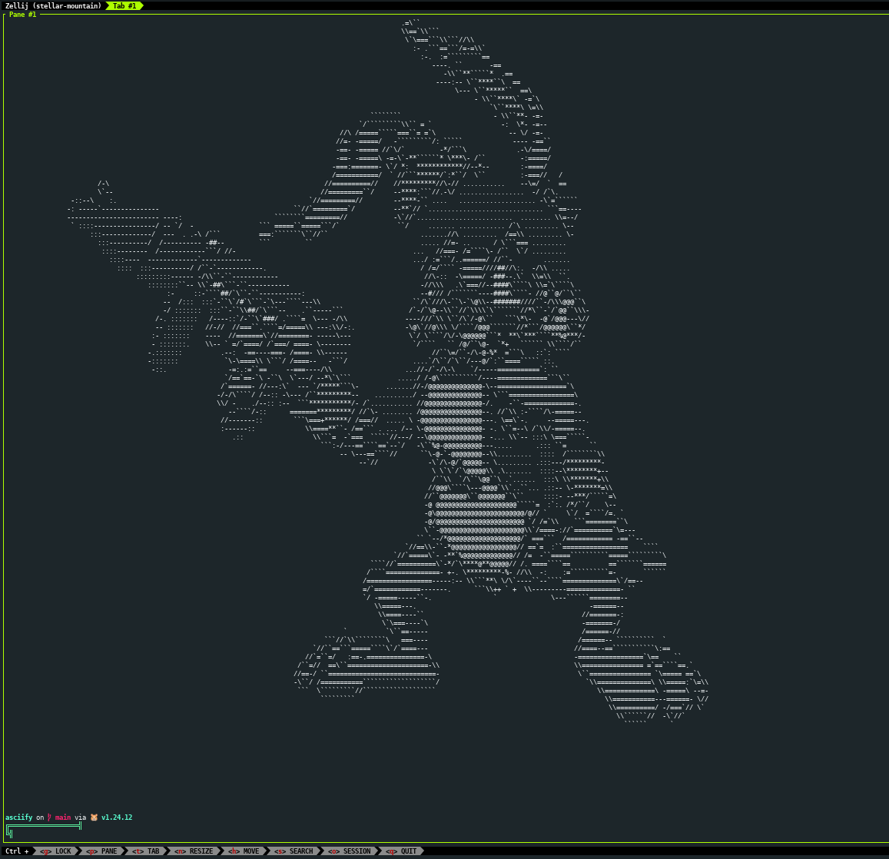
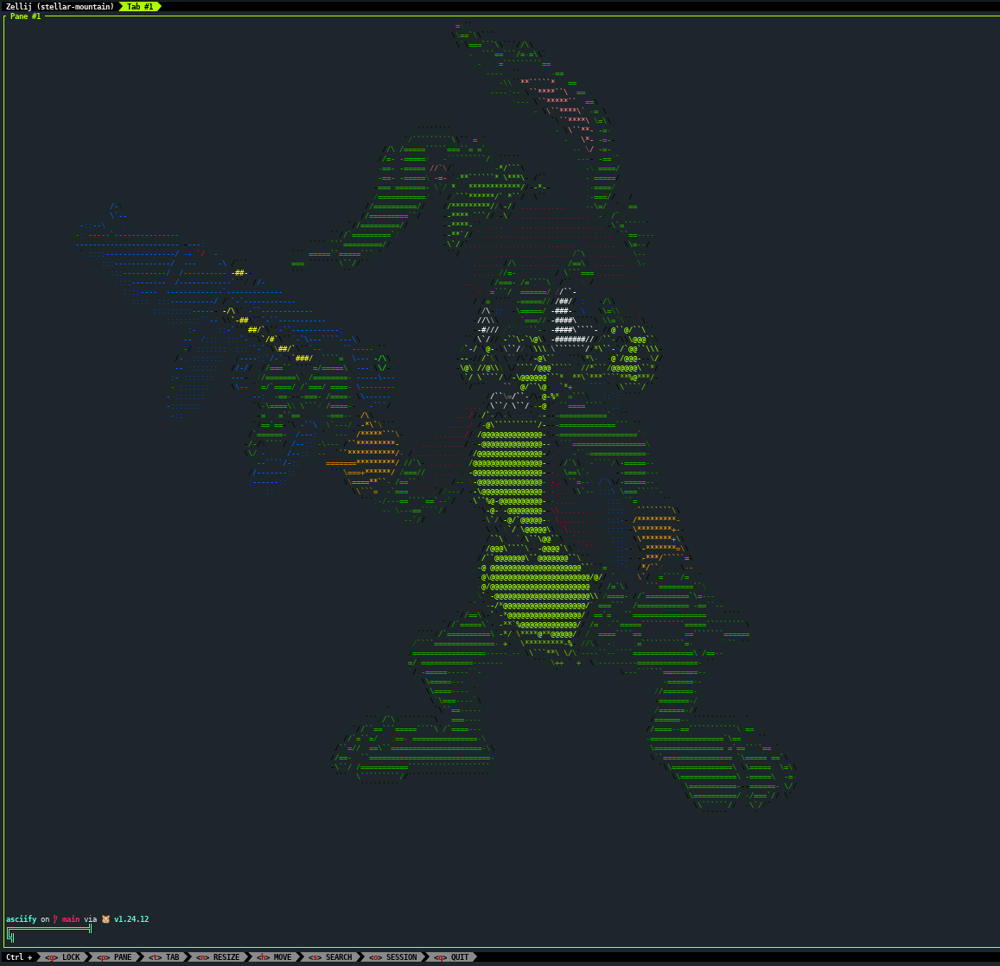
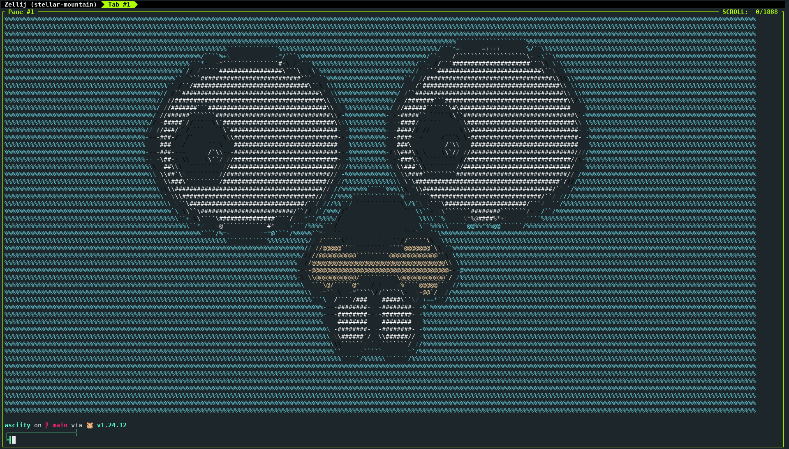

# ASCIIfy
Terminal ASCII Image Renderer

A fast, terminal-based ASCII art generator written in Go that converts images into beautiful ASCII representations using advanced luminance mapping and edge detection.

## Features

- **Smart Terminal Fitting**: Automatically detects terminal dimensions and scales images to fit perfectly
- **Advanced Edge Detection**: Uses Sobel filters to enhance image clarity with directional characters
- **Aspect Ratio Preservation**: Accounts for terminal character proportions to display images correctly
- **Multiple Format Support**: PNG, JPEG, and GIF (single frame)
- **Modular Architecture**: Clean, extensible design ready for future enhancements

## Quick Start

### Prerequisites

- Go >= 1.19

### Installation

```bash
# Clone the repository
git clone git@github.com:kozmaoliver/asciify.git
cd asciify

# Build the tool
go build

# Or install globally
go install
```

### Usage
```bash
# Basic usage
./asciify path/to/your/image.png

# Examples
./asciify photo.jpg
./asciify ~/Pictures/landscape.png
./asciify ./images/portrait.gif
```

## How It Works

The tool follows a sophisticated pipeline to convert images to ASCII:
```
Image → Load → Terminal Sizing → Resize → Luminance → Edge Detection → ASCII Mapping → Render
```

1. **Image Loading**: Supports PNG, JPEG, and GIF formats
2. **Terminal Detection**: Automatically detects your terminal dimensions
3. **Smart Resizing**: Scales image while preserving aspect ratio
4. **Luminance Analysis**: Calculates perceived brightness using L = 0.2126*R + 0.7152*G + 0.0722*B
5. **Edge Detection**: Applies Sobel filters to detect edges and directions
6. **Character Mapping**: Maps brightness to ASCII characters, uses directional chars for edges
7. **Terminal Rendering**: Outputs the final ASCII art to your terminal

> **Tip**: For best results, use images with good contrast and clear subjects. The edge detection works particularly well with architectural photos and portraits!

## Showcase

A generated ASCII image form my profile picture



Same with colors




